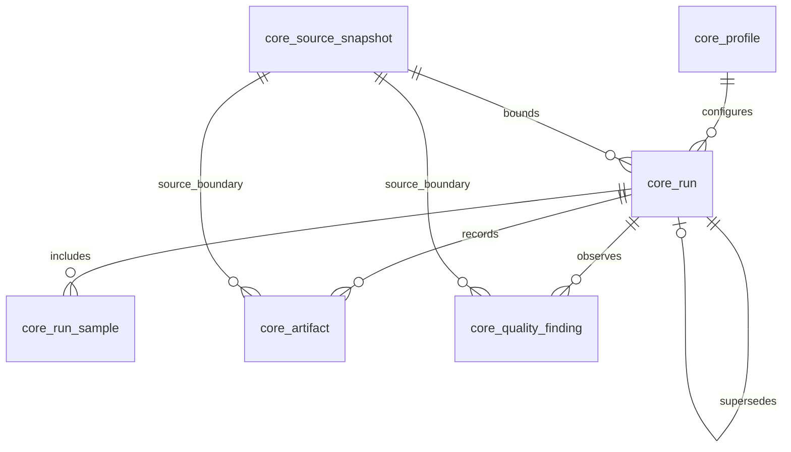

# ObsidianDroid Core v1: Phase 2B schema and import contract

## Boundary and final shape

Core owns a compact evidence ledger, not a copy of Erebus, Permission Intel,
VirusTotal, APKs, feature matrices, predictions, queues, or retention systems.
It has exactly seven application tables: `core_schema_migration`,
`core_profile`, `core_source_snapshot`, `core_run`, `core_run_sample`,
`core_artifact`, and `core_quality_finding`.  There are no cross-schema foreign
keys.  `0001_core_evidence_foundation.sql` is immutable historical foundation
(`fd65d0106b50484da3ca802f8a2b98649f9bac06993989c5602f09d30c0badae`);
`0002_core_evidence_contracts.sql` completes its contracts additively.



## Table contracts

| Table | identity and links | writer / reader | retention and mutation |
|---|---|---|---|
| `core_schema_migration` | `migration_version` PK; unique migration SHA and receipt. | Dedicated Core migrator; auditor. | Append a ledger row only after DDL succeeds. `applied`/`rolled_back` are the only ledger states; failed DDL appears only in a receipt. |
| `core_profile` | Stable ASCII `profile_id` PK. Version, contract hash, repository commit, and redacted JSON supplement identity. | Importer; run/audit readers. | Insert-once by identity. Corrected profile evidence is a new profile/version, not a silent rewrite. |
| `core_source_snapshot` | Auto ID plus optional unique stable `snapshot_key`. | Importer; audit readers. | An observed source boundary, not a dump. The source query version is distinct from the canonical SHA-256 of `core-approved-source-query-contract-v1`; membership checksum, counts, status and receipt preserve what was observed. |
| `core_run` | ASCII `run_id` PK, optional legacy ID, profile FK, optional snapshot FK, optional self-supersession FK. | Importer; run/audit readers. | Ledger-only and snapshot-backed runs are valid. Correction creates a replacement run and explicit `supersedes_run_id`. |
| `core_run_sample` | `(run_id, sample_key)` PK; no Erebus FK. | Importer; cohort/audit readers. | One frozen membership claim. Source namespace, hash and observed labels retain historical meaning. Current taxonomy is never substituted. |
| `core_artifact` | `(run_id, artifact_role)` PK; optional snapshot FK. | Importer/validator; auditors. | Metadata can truthfully describe absent files, unresolved legacy paths and `.latest` pointers. `sha256` is preserved 0001 legacy expected-hash field; 0002 `expected_*` and `observed_*` fields are definitive. |
| `core_quality_finding` | Auto finding ID; run FK and optional snapshot/sample. | Importer/reviewer; quality auditors. | Findings are append-oriented. An unresolved row has no selected value; Core does not mutate taxonomy. |

All tables are InnoDB with `utf8mb4_unicode_ci`; stable IDs and hashes use
ASCII binary collation. UTC values are application-written `DATETIME(6)` except
the reviewed executor uses `UTC_TIMESTAMP(6)` for its ledger insertion.
Foreign keys use MariaDB's restrictive default delete behavior. No normal
application delete is permitted.

## State-enforcement inventory

`CHECK` constraints enforce stable vocabulary and listed cross-field facts.
The importer validates parent ordering, source identity/hash agreement,
selection-rule agreement, one snapshot per run, and no supersession cycles;
cycle detection needs graph inspection and is therefore importer-only rather
than a MariaDB row-local CHECK. No normal writer performs broad state
transitions: evidence correction is append/replacement-oriented.

| Field | allowed values / default | DB CHECK | importer / transition rule | unknown / contradiction |
|---|---|---|---|---|
| `run_status` | planned, running, completed, failed, rejected, superseded / required | yes | source/import policy validates lifecycle | no `unknown`; status/evidence may be incomplete by design |
| `run_kind` | ledger_only, snapshot_backed / ledger_only | yes + snapshot pair | importer derives from snapshot presence | no unknown; contradictory snapshot state rejected |
| `evidence_completeness_status` | documented run evidence vocabulary / required | yes + kind pair | importer derives ledger/snapshot state | no unknown; cross-kind contradiction rejected |
| `snapshot_status` | planned, observed, validated, rejected / required | yes | importer uses observed for legacy source | no unknown; validation status stays separate |
| `validation_status` | planned, validated, rejected, unknown / planned | yes | validation promotion is reviewed | unknown allowed |
| sample `inclusion_role` | governed, prepared, aligned, trainable, train, test, excluded / required | yes | importer never infers modeled status | no unknown; `aligned` is used for imported source membership |
| sample `supervised_status` | eligible, ineligible, not_applicable, unknown / required | yes | later classifier may assign it | unknown allowed |
| sample `split_status` | train, test, validation, not_assigned, excluded, unknown / required | yes | no split invented | unknown allowed |
| sample `label_authority_state` | resolved, unresolved, conflicted, unknown / unknown | yes | historic labels are not made current authority | unknown allowed |
| sample `evidence_state` | observed, snapshot_backed, imported, rejected, unknown / unknown | yes | importer selects observed/unknown | unknown allowed |
| artifact `availability_status` | present, missing, mutable_pointer_only, legacy_path_unresolved, archive_candidate_found, unknown / required | yes + pointer pair | path classifier / validator sets it | unknown allowed; mutable status must equal pointer flag |
| artifact `hash_validation_status` | validated, mismatch, unavailable, not_recorded, not_applicable, unknown / required | yes + hash rules | validator may promote only with bytes | unknown allowed; validated/mismatch require expected+observed hashes |
| artifact pointer flag/kind | 0/1 and none/latest_alias/symlink/other / 0, none | yes + pair | classifier sets both together | no contradictory pair |
| artifact retention/storage/recovery/confidence/evidence | constrained documented vocabularies / metadata_only, unknown, unknown, unknown, unknown | yes | ingestion is metadata-only unless separately validated | unknown allowed |
| finding `resolution_status` | open, reviewed, resolved, accepted_limitation, rejected, superseded / open | yes + selected-value rule | reviewer transition is explicit and receipted | no unknown; selected value only resolved/accepted |

## Canonical states and transitions

| Domain | allowed values / rule |
|---|---|
| Run evidence | `ledger_only`, `snapshot_backed`, `incomplete`, `persistence_disabled`, `persistence_failed`, `imported`, `import_rejected`, `superseded`. A ledger-only run has no snapshot; snapshot-backed requires a snapshot reference. |
| Artifact availability | `present`, `missing`, `mutable_pointer_only`, `legacy_path_unresolved`, `archive_candidate_found`, `unknown`. |
| Artifact hash | `validated`, `mismatch`, `unavailable`, `not_recorded`, `not_applicable`, `unknown`. A `.latest` pointer is `mutable_pointer_only`/`not_applicable`, never immutable evidence. |
| Import receipt | `planned`, `validated`, `imported`, `rejected`, `rolled_back`, `failed`. Plans/receipts are local files; only successful imports create Core evidence rows. |
| Finding | `open`, `reviewed`, `resolved`, `accepted_limitation`, `rejected`, `superseded`. `selected_value` is legal only for resolved or accepted-limitation evidence. |

The importer rejects missing natural IDs, child/run disagreement, duplicate
sample keys, more than one source snapshot per run, existing destination hash
mismatch, selection-rule disagreement, invalid constrained states, and
supersession cycles. A repeated plan with the same
source-record hash is `already_imported`; it does not duplicate evidence.

## Migration and import safety

The executor discovers contiguous `0001...NNNN` SQL files, hashes each file,
checks existing ledger checksums, and applies only an explicitly named
`od_core_phase2b_validate_<UTC>` target in Phase 2B. It receives an injected
Core-only connection factory and never imports `db_engine.execute_query` or
Permission Intel helpers. MariaDB DDL can implicitly commit: a failed DDL is
not ledgered as applied, is recorded in a credential-free receipt, and needs
operator review before retry. Schema changes are idempotent only once their
ledger row and hash agree.

Import ordering is `profile → snapshot → run → samples/artifacts/findings`.
One Core transaction encompasses a synthetic plan. A failure rolls back only
the active destination transaction; it never writes source databases or
modifies/copies filesystem artifacts. Normal operations are insert-only.
Corrections create a replacement run and explicit supersession. Administrator
exceptions require separately reviewed maintenance, a receipt, and no hidden
delete of evidence.

## July 18 controlled fixture

The first planned controlled import remains source run
`20260718T032717Z__a8cf01`, planner `core-evidence-dry-run-v1`, expected 1
profile, 1 run, 1 snapshot, 9,716 memberships, 57 artifact metadata rows and
0 findings. The preserved preview plan SHA is
`715d7046cf04385a364b0ae25263115feb333200642d1cf28904ad3fafcbca3a`.
It is diagnostic, non-publication, not paper evidence, not predictions, and is
never automatically executed. It may be considered only after production
provisioning and a separately approved controlled-import authorization.

## Applied service-account grant contract

```sql
GRANT CREATE, ALTER, INDEX, REFERENCES ON obsidiandroid_core_prod.* TO 'obsidiandroid_core_migrator'@'localhost';
GRANT SELECT, INSERT ON obsidiandroid_core_prod.core_schema_migration TO 'obsidiandroid_core_migrator'@'localhost';
GRANT SELECT ON obsidiandroid_core_prod.core_run TO 'obsidiandroid_core_writer'@'localhost';
GRANT INSERT ON obsidiandroid_core_prod.core_profile TO 'obsidiandroid_core_writer'@'localhost';
GRANT INSERT ON obsidiandroid_core_prod.core_source_snapshot TO 'obsidiandroid_core_writer'@'localhost';
GRANT INSERT ON obsidiandroid_core_prod.core_run TO 'obsidiandroid_core_writer'@'localhost';
GRANT INSERT ON obsidiandroid_core_prod.core_run_sample TO 'obsidiandroid_core_writer'@'localhost';
GRANT INSERT ON obsidiandroid_core_prod.core_artifact TO 'obsidiandroid_core_writer'@'localhost';
GRANT INSERT ON obsidiandroid_core_prod.core_quality_finding TO 'obsidiandroid_core_writer'@'localhost';
GRANT SELECT ON obsidiandroid_core_prod.core_schema_migration TO 'obsidiandroid_core_auditor'@'localhost';
GRANT SELECT ON obsidiandroid_core_prod.core_profile TO 'obsidiandroid_core_auditor'@'localhost';
GRANT SELECT ON obsidiandroid_core_prod.core_source_snapshot TO 'obsidiandroid_core_auditor'@'localhost';
GRANT SELECT ON obsidiandroid_core_prod.core_run TO 'obsidiandroid_core_auditor'@'localhost';
GRANT SELECT ON obsidiandroid_core_prod.core_run_sample TO 'obsidiandroid_core_auditor'@'localhost';
GRANT SELECT ON obsidiandroid_core_prod.core_artifact TO 'obsidiandroid_core_auditor'@'localhost';
GRANT SELECT ON obsidiandroid_core_prod.core_quality_finding TO 'obsidiandroid_core_auditor'@'localhost';
GRANT SELECT ON erebus_threat_intel_prod.analysis_run TO 'obsidiandroid_erebus_reader'@'localhost';
GRANT SELECT ON erebus_threat_intel_prod.analysis_snapshot TO 'obsidiandroid_erebus_reader'@'localhost';
GRANT SELECT ON erebus_threat_intel_prod.analysis_snapshot_sample TO 'obsidiandroid_erebus_reader'@'localhost';
GRANT SELECT ON erebus_threat_intel_prod.analysis_artifact TO 'obsidiandroid_erebus_reader'@'localhost';
GRANT SELECT ON erebus_threat_intel_prod.snapshot_label_conflict TO 'obsidiandroid_erebus_reader'@'localhost';
```

The initial normal writer is insert-only: it receives one `SELECT` privilege
for run-level idempotency checks and no `UPDATE` or `DELETE` privilege. A future
need for a state transition requires a separately reviewed grant amendment.
The migrator is local-only and normally locked; it has no `DROP`, source, or
global privilege. No account receives `CREATE USER`, `GRANT OPTION`, global
privileges, or source writes. The reader receives `SELECT` on exactly the five
approved Erebus base tables and no Core privilege. A Permission Intel reader is
deferred until an approved import contract demonstrates the need.

## Provisioning, Phase 2C, and Phase 2D gates

Provisioning review must confirm exactly seven Core tables, migration versions
and hashes, no views/triggers/routines/events, no cross-schema FKs, disabled
persistence, no Phase 2A routing, appropriate accounts, and an empty
`obsidiandroid_core_prod`. Phase 2C requires a reviewed live-source contract
and a `Phase2CImportAuthorization` bound to the exact deterministic plan SHA
and source run. The normal pipeline cannot supply that authorization. Phase 2D
requires a successful retained fixture receipt plus separate approval before
any pipeline integration.
